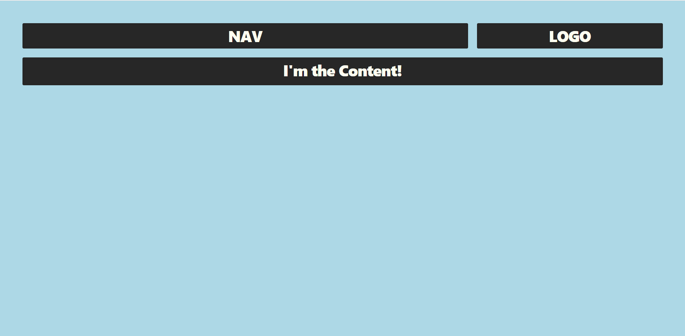

We have two challenges.

1. You can position elements using CSS.
  - Clone this repo
  - Open the ./position-elements/index.html file in a text editor and browser
  - Within the `` tags of index.html alter the css so that it
    matches the following image
  - You may not alter the HTML
  - Can you use css grid or flex box or bootstrap 4
    

2. You can solve this [Leetcode challenge](https://leetcode.com/problems/two-sum/)
